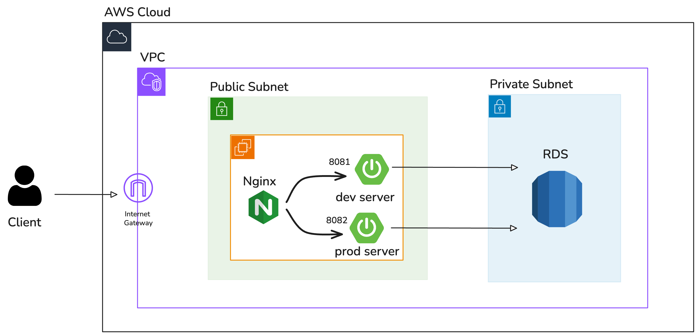
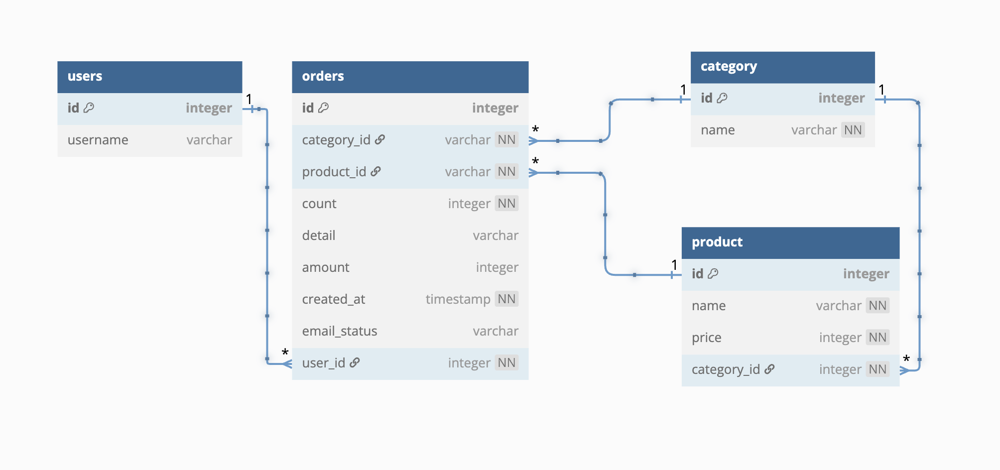

# 📦발주 예약 시스템

View가 존재하지 않는 발주 예약 시스템입니다.

### Infra

- [x] 애플리케이션을 AWS에 배포 가능한 상태로 구축
  - Spring Boot Application이 돌아가는가?
- [x] 애플리케이션 서버 / 데이터베이스 서버 분리
  - 애플리케이션 서버(public): `sana-lv3-mission`
  - 데이터베이스 서버(private RDS): `sana-lv3-db`
- [x] dev/prod의 설정을 서로 독립적으로 관리 및 배포
  - 개발 서버 접속: http://43.203.120.68/dev
  - 운영 서버 접속: http://43.203.120.68/prod

제가 설계한 아키텍처는 하나의 EC2 서버에서 Nginx를 이용해 dev와 prod 환경을 분리하고, 

두 환경에서 동일한 RDS 데이터베이스를 공유하도록 구성했습니다. 

이를 통해 코드 변경이나 테스트가 필요한 경우 dev 환경에서 안전하게 검증한 뒤 prod로 간단하게 배포할 수 있으며, 

데이터는 두 환경 간 일관성을 유지할 수 있습니다. 

또한, Nginx를 통한 포트 기반 라우팅과 Spring Boot의 프로파일 분리를 활용하여 환경별 설정을 독립적으로 관리할 수 있어, 

장애 발생 시에도 특정 환경만 영향을 받도록 대응할 수 있습니다. 

이러한 설계를 통해 서비스가 크지 않고 요청이 많이 들어오지 않는 환경에서 설정 파일을 하나의 서버에서 관리하기 쉽게 만들었습니다. 

그리고 RDS를 이번 미션을 통해 처음 도입해보며 AWS에서 제공하는 데이터베이스 관리 환경의 장점을 체감할 수 있었습니다.

### 사용자 기능 분석

- [x] 사용자는 상품의 발주를 예약할 수 있다.
  - [x] 상품은 카테고리, 품목, 수량 그리고 세부사항를 필수로 입력
- [x] 사용자는 자신의 발주 내역을 확인할 수 있다.
  - [x] 상품의 정보, 최근 업데이트 시간, 이메일 전송 상태 출력
  - [x] 수정, 삭제 이후에도 발주 내역을 확인 가능
- [x] 사용자는 자신의 발주 내역을 수정할 수 있다.
  - [x] 수정 후에는 최근 업데이트 시간을 갱신 후, 이메일 재전송
- [x] 사용자는 자신의 발주 내역을 삭제할 수 있다.
  - [x] 삭제 후에는 이메일 재전송
- [x] 현재의 기능에서는 `이메일 전송 완료` 상태만 사용자에게 보여진다.
- [x] 사용자 이름을 입력한 후에 발주 허용 가능한 이름인지 확인한다.
  - [x] 이후, 토큰을 발급하여 권한을 확인

### Database ERD

